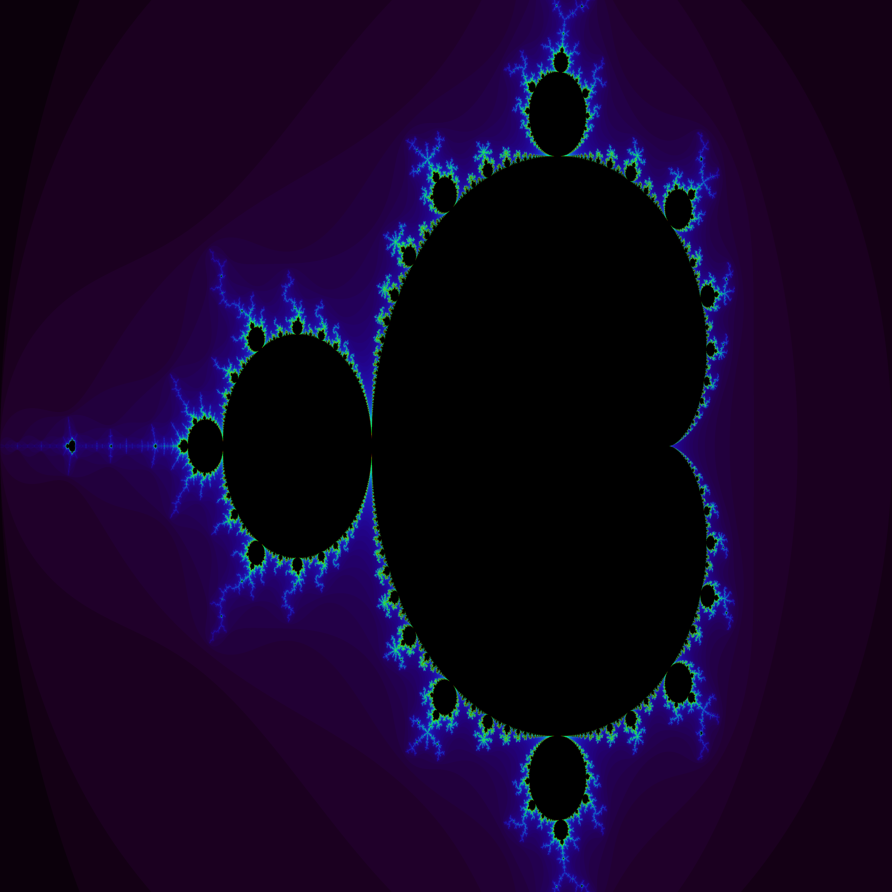

# Mandelbrot

Me exploring mandelbrot styled fractals. I have made a mandelbrot generator in python, I will aim do one in C as well.

## Compile and run main.c
```bash
gcc main.c -lpng -lm -o main
./main
```


